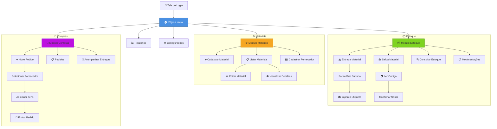

# Mapa de Navegação do Sistema

```mermaid
graph TD
    Login[🔐 Tela de Login] --> Home[🏠 Página Inicial]
    
    Home --> ModEst[📦 Módulo Estoque]
    Home --> ModMat[⚙️ Módulo Materiais]
    Home --> ModComp[🛒 Módulo Compras]
    Home --> ModRel[📊 Relatórios]
    Home --> Config[⚙️ Configurações]
    
    subgraph "📦 Estoque"
        ModEst --> EntMat[📥 Entrada Material]
        ModEst --> SaiMat[📤 Saída Material]
        ModEst --> ConEst[🔍 Consultar Estoque]
        ModEst --> MovEst[📋 Movimentações]
        
        EntMat --> FormEnt[Formulário Entrada]
        FormEnt --> ImpEtiq[🖨️ Imprimir Etiqueta]
        
        SaiMat --> LerCod[📷 Ler Código]
        LerCod --> ConfSai[Confirmar Saída]
    end
    
    subgraph "⚙️ Materiais"
        ModMat --> CadMat[➕ Cadastrar Material]
        ModMat --> ListMat[📋 Listar Materiais]
        ModMat --> CadForn[🏭 Cadastrar Fornecedor]
        
        ListMat --> EditMat[✏️ Editar Material]
        ListMat --> ViewMat[👁️ Visualizar Detalhes]
    end
    
    subgraph "🛒 Compras"
        ModComp --> NovoPed[➕ Novo Pedido]
        ModComp --> ListPed[📋 Pedidos]
        ModComp --> AcompEnt[🚚 Acompanhar Entregas]
        
        NovoPed --> SelForn[Selecionar Fornecedor]
        SelForn --> AddItens[Adicionar Itens]
        AddItens --> EnvPed[📧 Enviar Pedido]
    end
    
    style Home fill:#4A90E2,stroke:#2E5C8A,color:#fff
    style ModEst fill:#7ED321,stroke:#5A9E17
    style ModMat fill:#F5A623,stroke:#D4900F
    style ModComp fill:#BD10E0,stroke:#9012FE
```