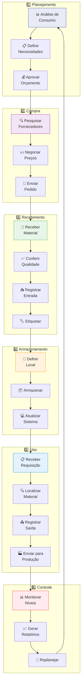

# Processo de Negócio - Ciclo Completo

```mermaid
graph TD
    subgraph "1️⃣ Planejamento"
        P1[📊 Análise de<br/>Consumo]
        P2[📋 Definir<br/>Necessidades]
        P3[💰 Aprovar<br/>Orçamento]
    end
    
    subgraph "2️⃣ Compra"
        C1[🔍 Pesquisar<br/>Fornecedores]
        C2[💵 Negociar<br/>Preços]
        C3[📧 Enviar<br/>Pedido]
    end
    
    subgraph "3️⃣ Recebimento"
        R1[🚚 Receber<br/>Material]
        R2[✅ Conferir<br/>Qualidade]
        R3[📥 Registrar<br/>Entrada]
        R4[🏷️ Etiquetar]
    end
    
    subgraph "4️⃣ Armazenamento"
        A1[📍 Definir<br/>Local]
        A2[📦 Armazenar]
        A3[💻 Atualizar<br/>Sistema]
    end
    
    subgraph "5️⃣ Uso"
        U1[📋 Receber<br/>Requisição]
        U2[🔍 Localizar<br/>Material]
        U3[📤 Registrar<br/>Saída]
        U4[🏭 Enviar para<br/>Produção]
    end
    
    subgraph "6️⃣ Controle"
        CT1[📊 Monitorar<br/>Níveis]
        CT2[📈 Gerar<br/>Relatórios]
        CT3[🔄 Replanejar]
    end
    
    P1 --> P2 --> P3 --> C1

    C1 --> C2 --> C3 --> R1

    R1 --> R2 --> R3 --> R4 --> A1
    A1 --> A2 --> A3 --> U1
    U1 --> U2 --> U3 --> U4 --> CT1
    CT1 --> CT2 --> CT3 --> P1
    
    style P1 fill:#E8EAF6,stroke:#3F51B5
    style C1 fill:#F3E5F5,stroke:#9C27B0
    style R1 fill:#E8F5E9,stroke:#4CAF50
    style A1 fill:#FFF3E0,stroke:#FF9800
    style U1 fill:#E3F2FD,stroke:#2196F3
    style CT1 fill:#FFEBEE,stroke:#F44336
```