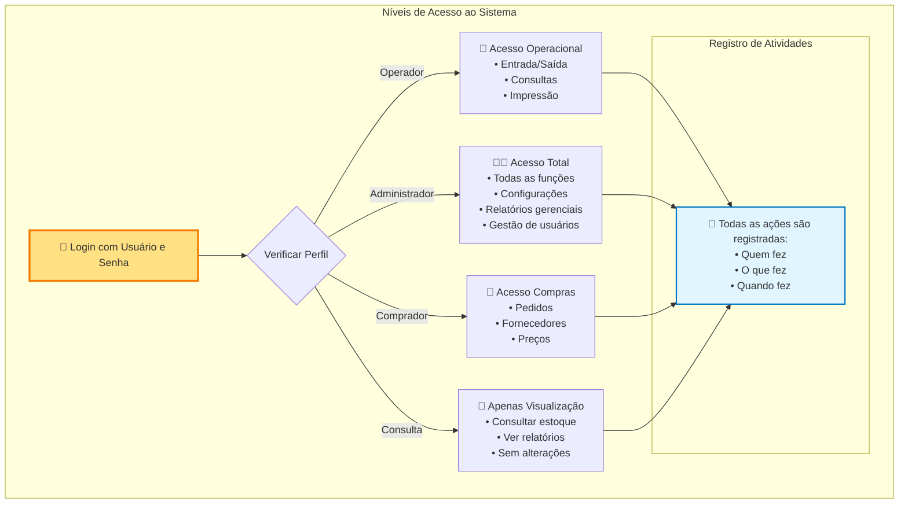

# Segurança e Acessos

```mermaid
graph TD
    subgraph "Níveis de Acesso ao Sistema"
        LOGIN[🔐 Login com Usuário e Senha]
        
        LOGIN --> CHECK{Verificar Perfil}
        
        CHECK -->|Operador| OP[👷 Acesso Operacional<br/>• Entrada/Saída<br/>• Consultas<br/>• Impressão]
        
        CHECK -->|Administrador| ADM[👨‍💼 Acesso Total<br/>• Todas as funções<br/>• Configurações<br/>• Relatórios gerenciais<br/>• Gestão de usuários]
        
        CHECK -->|Comprador| COMP[🛒 Acesso Compras<br/>• Pedidos<br/>• Fornecedores<br/>• Preços]
        
        CHECK -->|Consulta| CONS[👀 Apenas Visualização<br/>• Consultar estoque<br/>• Ver relatórios<br/>• Sem alterações]
        
        subgraph "Registro de Atividades"
            LOG[📝 Todas as ações são registradas:<br/>• Quem fez<br/>• O que fez<br/>• Quando fez]
        end
        
        OP --> LOG
        ADM --> LOG
        COMP --> LOG
        CONS --> LOG
    end
    
    style LOGIN fill:#FFE082,stroke:#F57C00,stroke-width:3px
    style LOG fill:#E1F5FE,stroke:#0277BD,stroke-width:2px
```