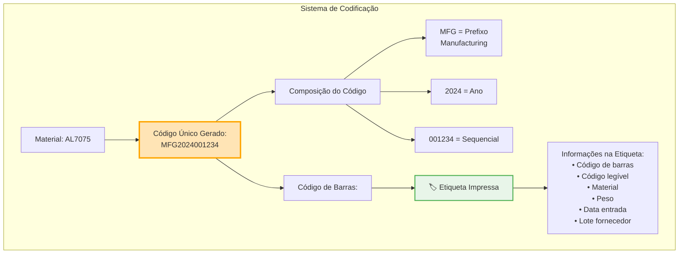

# Estrutura de Códigos e Identificação

```mermaid
graph TD
    subgraph "Sistema de Codificação"
        MAT[Material: AL7075]
        
        MAT --> CODE[Código Único Gerado:<br/>MFG2024001234]
        
        CODE --> PARTS[Composição do Código]
        
        PARTS --> P1[MFG = Prefixo<br/>Manufacturing]
        PARTS --> P2[2024 = Ano]
        PARTS --> P3[001234 = Sequencial]
        
        CODE --> BARCODE[Código de Barras:<br/> ]
        
        BARCODE --> LABEL[🏷️ Etiqueta Impressa]
        
        LABEL --> INFO[Informações na Etiqueta:<br/>• Código de barras<br/>• Código legível<br/>• Material<br/>• Peso<br/>• Data entrada<br/>• Lote fornecedor]
    end
    
    style CODE fill:#FFE4B5,stroke:#FFA500,stroke-width:3px
    style LABEL fill:#E8F5E9,stroke:#4CAF50,stroke-width:2px
```