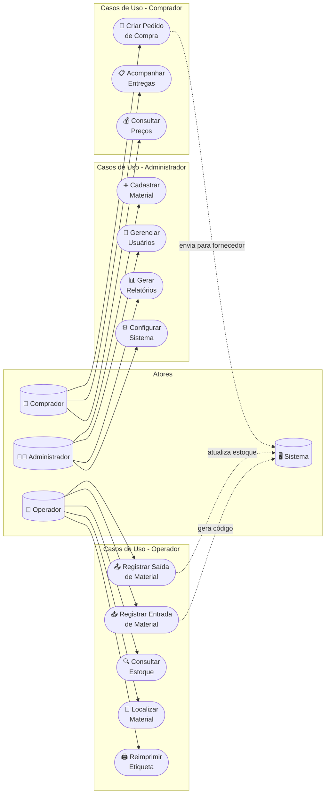

# Casos de Uso Principais

```mermaid
graph LR
    subgraph "Atores"
        OP[("👷 Operador")]
        ADM[("👨‍💼 Administrador")]
        COMP[("🛒 Comprador")]
        SIST[("🖥️ Sistema")]
    end
    
    subgraph "Casos de Uso - Operador"
        UC1(["📥 Registrar Entrada<br/>de Material"])
        UC2(["📤 Registrar Saída<br/>de Material"])
        UC3(["🔍 Consultar<br/>Estoque"])
        UC4(["📍 Localizar<br/>Material"])
        UC5(["🖨️ Reimprimir<br/>Etiqueta"])
    end
    
    subgraph "Casos de Uso - Administrador"
        UC6(["➕ Cadastrar<br/>Material"])
        UC7(["👥 Gerenciar<br/>Usuários"])
        UC8(["📊 Gerar<br/>Relatórios"])
        UC9(["⚙️ Configurar<br/>Sistema"])
    end
    
    subgraph "Casos de Uso - Comprador"
        UC10(["🛒 Criar Pedido<br/>de Compra"])
        UC11(["📋 Acompanhar<br/>Entregas"])
        UC12(["💰 Consultar<br/>Preços"])
    end
    
    OP --> UC1
    OP --> UC2
    OP --> UC3
    OP --> UC4
    OP --> UC5
    
    ADM --> UC6
    ADM --> UC7
    ADM --> UC8
    ADM --> UC9
    
    COMP --> UC10
    COMP --> UC11
    COMP --> UC12
    
    UC1 -.->|gera código| SIST
    UC2 -.->|atualiza estoque| SIST
    UC10 -.->|envia para fornecedor| SIST
```