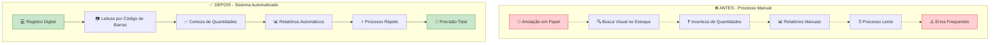

# Comparativo: Antes vs Depois do Sistema

```mermaid
graph TB
    subgraph "❌ ANTES - Processo Manual"
        A1[📝 Anotação em Papel]
        A2[🔍 Busca Visual no Estoque]
        A3[❓ Incerteza de Quantidades]
        A4[📊 Relatórios Manuais]
        A5[⏰ Processo Lento]
        A6[⚠️ Erros Frequentes]
        
        A1 -.-> A2
        A2 -.-> A3
        A3 -.-> A4
        A4 -.-> A5
        A5 -.-> A6
    end
    
    subgraph "✅ DEPOIS - Sistema Automatizado"
        D1[💻 Registro Digital]
        D2[📷 Leitura por Código de Barras]
        D3[✅ Certeza de Quantidades]
        D4[📊 Relatórios Automáticos]
        D5[⚡ Processo Rápido]
        D6[🎯 Precisão Total]
        
        D1 --> D2
        D2 --> D3
        D3 --> D4
        D4 --> D5
        D5 --> D6
    end
    
    style A1 fill:#FFCDD2,stroke:#D32F2F
    style A6 fill:#FFCDD2,stroke:#D32F2F
    style D1 fill:#C8E6C9,stroke:#388E3C
    style D6 fill:#C8E6C9,stroke:#388E3C
```