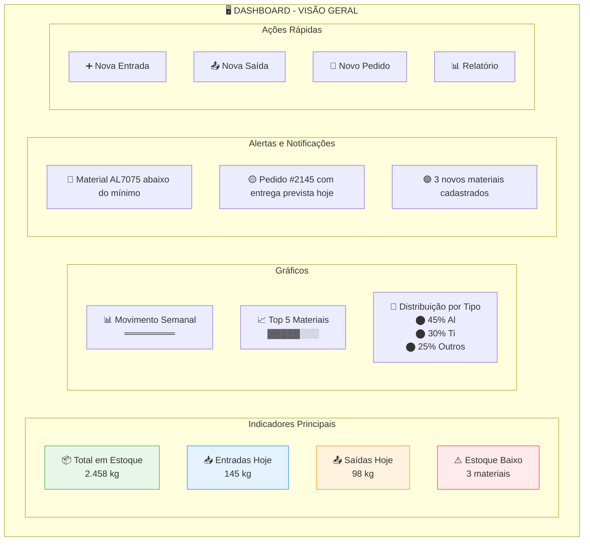

# Dashboard Principal - Visão do Gestor

```mermaid
graph TB
    subgraph "🖥️ DASHBOARD - VISÃO GERAL"
        subgraph "Indicadores Principais"
            IND1[📦 Total em Estoque<br/>2.458 kg]
            IND2[📥 Entradas Hoje<br/>145 kg]
            IND3[📤 Saídas Hoje<br/>98 kg]
            IND4[⚠️ Estoque Baixo<br/>3 materiais]
        end
        
        subgraph "Gráficos"
            GRAF1[📊 Movimento Semanal<br/>════════]
            GRAF2[📈 Top 5 Materiais<br/>▓▓▓▓▓░░░]
            GRAF3[🥧 Distribuição por Tipo<br/>⬤ 45% Al<br/>⬤ 30% Ti<br/>⬤ 25% Outros]
        end
        
        subgraph "Alertas e Notificações"
            ALERT1[🔴 Material AL7075 abaixo do mínimo]
            ALERT2[🟡 Pedido #2145 com entrega prevista hoje]
            ALERT3[🟢 3 novos materiais cadastrados]
        end
        
        subgraph "Ações Rápidas"
            BTN1[➕ Nova Entrada]
            BTN2[📤 Nova Saída]
            BTN3[🛒 Novo Pedido]
            BTN4[📊 Relatório]
        end
    end
    
    style IND1 fill:#E8F5E9,stroke:#4CAF50
    style IND2 fill:#E3F2FD,stroke:#2196F3
    style IND3 fill:#FFF3E0,stroke:#FF9800
    style IND4 fill:#FFEBEE,stroke:#F44336
```