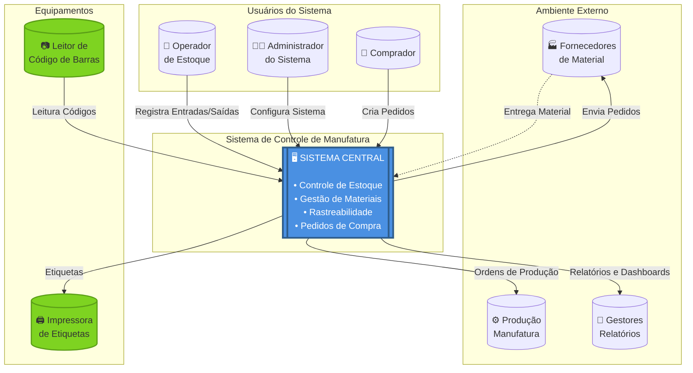

# Diagrama de Contexto - Visão Geral do Sistema

```mermaid
graph TB
    subgraph "Ambiente Externo"
        FORN[("🏭 Fornecedores<br/>de Material")]
        PROD[("⚙️ Produção<br/>Manufatura")]
        GEST[("👔 Gestores<br/>Relatórios")]
    end
    
    subgraph "Sistema de Controle de Manufatura"
        SIST[["🖥️ SISTEMA CENTRAL<br/><br/>• Controle de Estoque<br/>• Gestão de Materiais<br/>• Rastreabilidade<br/>• Pedidos de Compra"]]
    end
    
    subgraph "Equipamentos"
        IMP[("🖨️ Impressora<br/>de Etiquetas")]
        SCAN[("📷 Leitor de<br/>Código de Barras")]
    end
    
    subgraph "Usuários do Sistema"
        OP[("👷 Operador<br/>de Estoque")]
        ADM[("👨‍💼 Administrador<br/>do Sistema")]
        COMP[("🛒 Comprador")]
    end
    
    FORN -.->|Entrega Material| SIST
    SIST -->|Etiquetas| IMP
    SCAN -->|Leitura Códigos| SIST
    SIST -->|Ordens de Produção| PROD
    SIST -->|Relatórios e Dashboards| GEST
    
    OP -->|Registra Entradas/Saídas| SIST
    ADM -->|Configura Sistema| SIST
    COMP -->|Cria Pedidos| SIST
    SIST -->|Envia Pedidos| FORN
    
    style SIST fill:#4A90E2,stroke:#2E5C8A,stroke-width:3px,color:#fff
    style IMP fill:#7ED321,stroke:#5A9E17,stroke-width:2px
    style SCAN fill:#7ED321,stroke:#5A9E17,stroke-width:2px
```