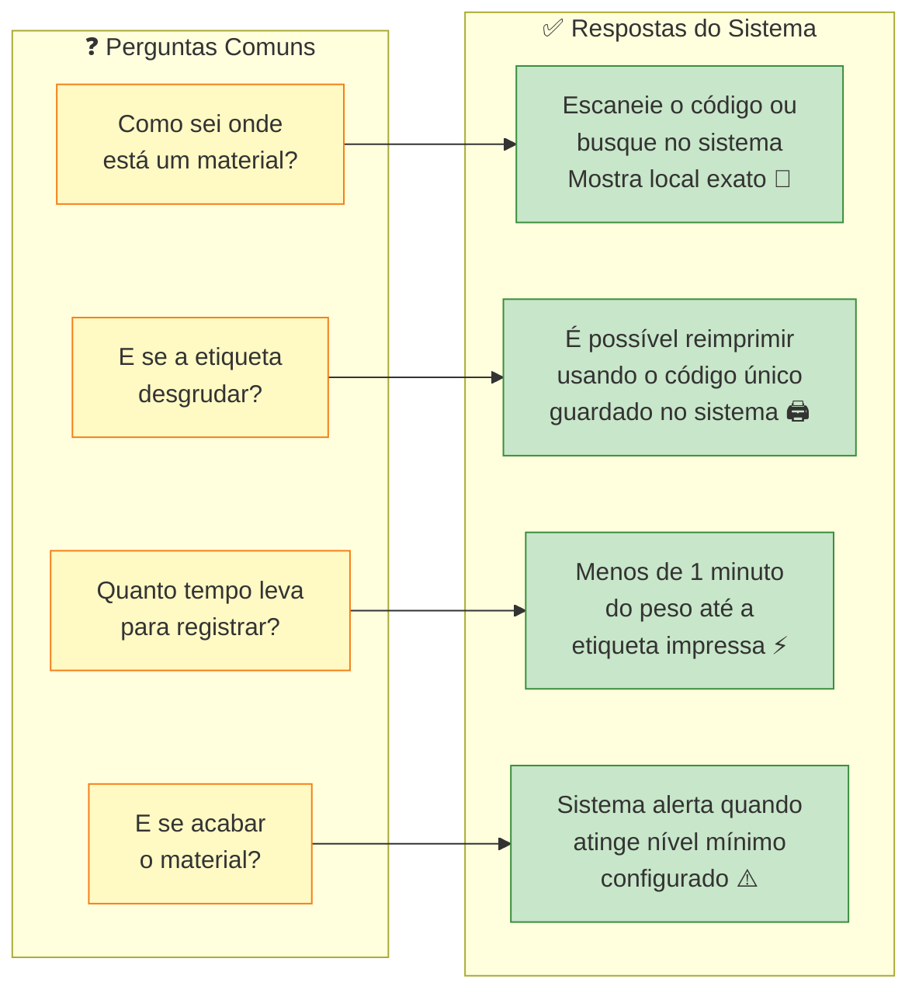

# FAQ Visual - Perguntas Frequentes

```mermaid
flowchart LR
    subgraph "❓ Perguntas Comuns"
        Q1[Como sei onde<br/>está um material?]
        Q2[E se a etiqueta<br/>desgrudar?]
        Q3[Quanto tempo leva<br/>para registrar?]
        Q4[E se acabar<br/>o material?]
    end
    
    subgraph "✅ Respostas do Sistema"
        A1[Escaneie o código ou<br/>busque no sistema<br/>Mostra local exato 📍]
        A2[É possível reimprimir<br/>usando o código único<br/>guardado no sistema 🖨️]
        A3[Menos de 1 minuto<br/>do peso até a<br/>etiqueta impressa ⚡]
        A4[Sistema alerta quando<br/>atinge nível mínimo<br/>configurado ⚠️]
    end
    
    Q1 --> A1
    Q2 --> A2
    Q3 --> A3
    Q4 --> A4
    
    style Q1 fill:#FFF9C4,stroke:#F57F17
    style Q2 fill:#FFF9C4,stroke:#F57F17
    style Q3 fill:#FFF9C4,stroke:#F57F17
    style Q4 fill:#FFF9C4,stroke:#F57F17
    style A1 fill:#C8E6C9,stroke:#388E3C
    style A2 fill:#C8E6C9,stroke:#388E3C
    style A3 fill:#C8E6C9,stroke:#388E3C
    style A4 fill:#C8E6C9,stroke:#388E3C
```