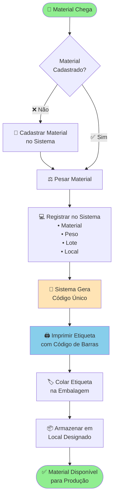

# Fluxo de Trabalho Principal - Visão Simplificada

```mermaid
flowchart TB
    Start([🚚 Material Chega]) --> Check{Material<br/>Cadastrado?}
    Check -->|❌ Não| Cad[📝 Cadastrar Material<br/>no Sistema]
    Cad --> Peso
    Check -->|✅ Sim| Peso[⚖️ Pesar Material]
    
    Peso --> Reg[💻 Registrar no Sistema<br/>• Material<br/>• Peso<br/>• Lote<br/>• Local]
    
    Reg --> Gen[🔢 Sistema Gera<br/>Código Único]
    Gen --> Print[🖨️ Imprimir Etiqueta<br/>com Código de Barras]
    Print --> Cole[🏷️ Colar Etiqueta<br/>na Embalagem]
    Cole --> Armaz[📦 Armazenar em<br/>Local Designado]
    Armaz --> Fim([✅ Material Disponível<br/>para Produção])
    
    style Start fill:#90EE90
    style Fim fill:#90EE90
    style Gen fill:#FFE4B5
    style Print fill:#87CEEB
```