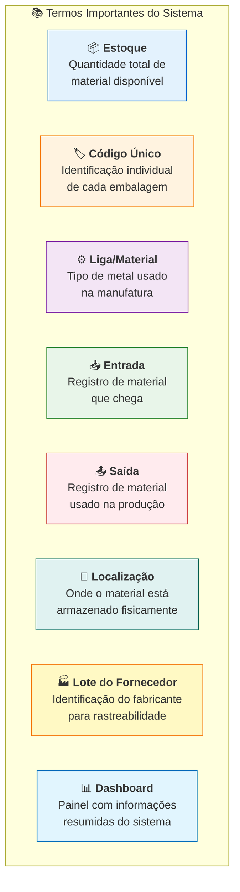

# Glossário Visual

```mermaid
graph TD
    subgraph "📚 Termos Importantes do Sistema"
        T1[📦 <b>Estoque</b><br/>Quantidade total de<br/>material disponível]
        
        T2[🏷️ <b>Código Único</b><br/>Identificação individual<br/>de cada embalagem]
        
        T3[⚙️ <b>Liga/Material</b><br/>Tipo de metal usado<br/>na manufatura]
        
        T4[📥 <b>Entrada</b><br/>Registro de material<br/>que chega]
        
        T5[📤 <b>Saída</b><br/>Registro de material<br/>usado na produção]
        
        T6[📍 <b>Localização</b><br/>Onde o material está<br/>armazenado fisicamente]
        
        T7[🏭 <b>Lote do Fornecedor</b><br/>Identificação do fabricante<br/>para rastreabilidade]
        
        T8[📊 <b>Dashboard</b><br/>Painel com informações<br/>resumidas do sistema]
    end
    
    style T1 fill:#E3F2FD,stroke:#1976D2
    style T2 fill:#FFF3E0,stroke:#F57C00
    style T3 fill:#F3E5F5,stroke:#7B1FA2
    style T4 fill:#E8F5E9,stroke:#388E3C
    style T5 fill:#FFEBEE,stroke:#C62828
    style T6 fill:#E0F2F1,stroke:#00695C
    style T7 fill:#FFF9C4,stroke:#F57F17
    style T8 fill:#E1F5FE,stroke:#0277BD
```