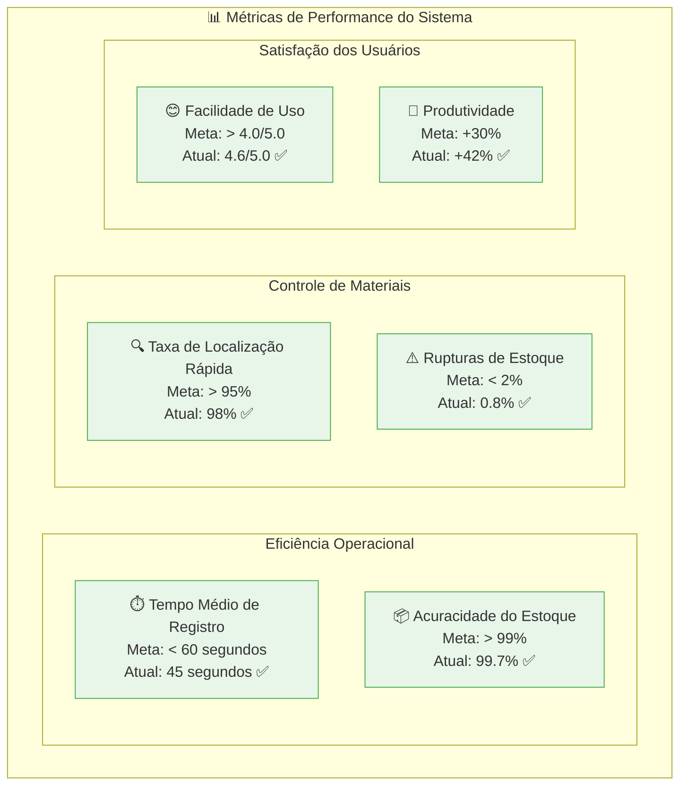

# Indicadores de Sucesso (KPIs)

```mermaid
graph TB
    subgraph "📊 Métricas de Performance do Sistema"
        subgraph "Eficiência Operacional"
            KPI1[⏱️ Tempo Médio de Registro<br/>Meta: < 60 segundos<br/>Atual: 45 segundos ✅]
            KPI2[📦 Acuracidade do Estoque<br/>Meta: > 99%<br/>Atual: 99.7% ✅]
        end
        
        subgraph "Controle de Materiais"
            KPI3[🔍 Taxa de Localização Rápida<br/>Meta: > 95%<br/>Atual: 98% ✅]
            KPI4[⚠️ Rupturas de Estoque<br/>Meta: < 2%<br/>Atual: 0.8% ✅]
        end
        
        subgraph "Satisfação dos Usuários"
            KPI5[😊 Facilidade de Uso<br/>Meta: > 4.0/5.0<br/>Atual: 4.6/5.0 ✅]
            KPI6[🚀 Produtividade<br/>Meta: +30%<br/>Atual: +42% ✅]
        end
    end
    
    style KPI1 fill:#E8F5E9,stroke:#4CAF50
    style KPI2 fill:#E8F5E9,stroke:#4CAF50
    style KPI3 fill:#E8F5E9,stroke:#4CAF50
    style KPI4 fill:#E8F5E9,stroke:#4CAF50
    style KPI5 fill:#E8F5E9,stroke:#4CAF50
    style KPI6 fill:#E8F5E9,stroke:#4CAF50
```