# Documentação de Software - Sistema de Manufatura Aditiva

## 1. Diagrama de Entidade Relacionamento (DER)

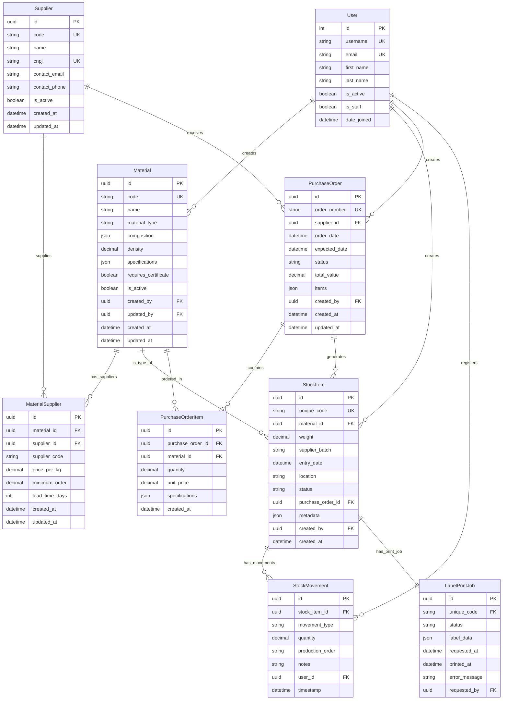

## 2. Diagramas de Sequência

### 2.1 Fluxo de Entrada de Material

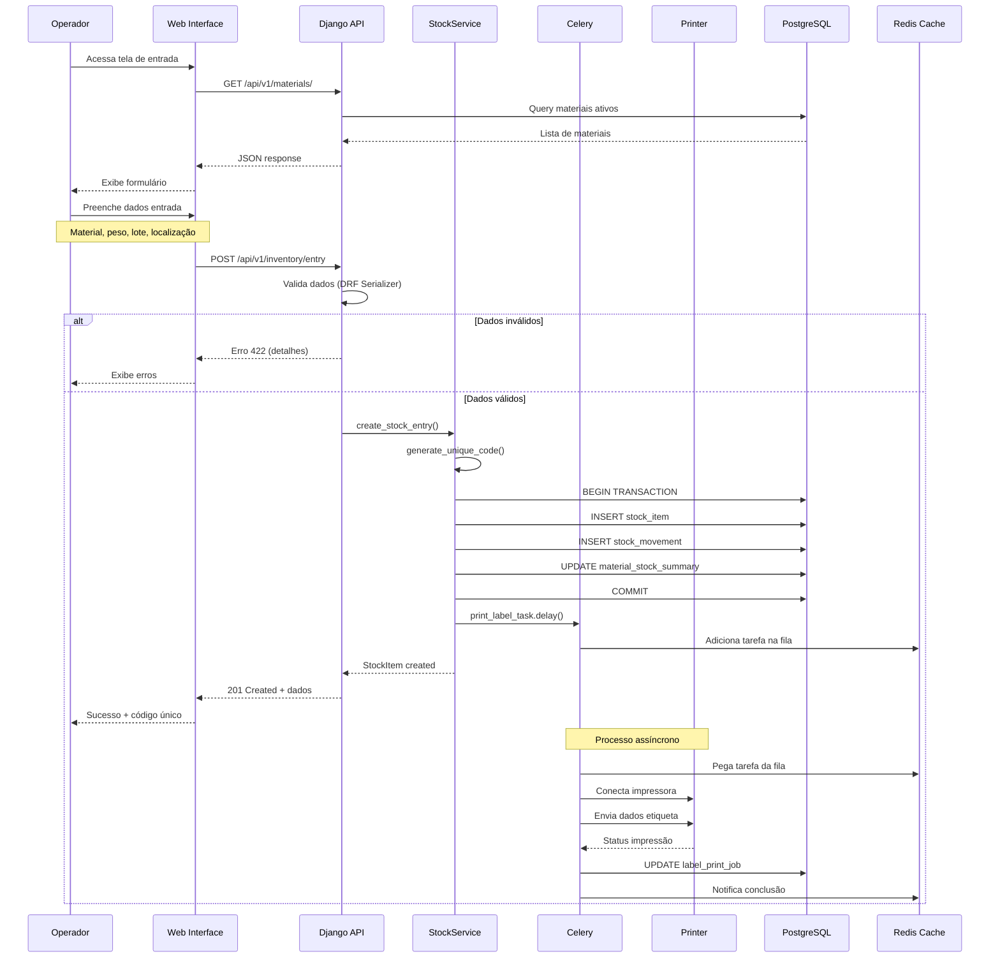

### 2.2 Fluxo de Saída de Material

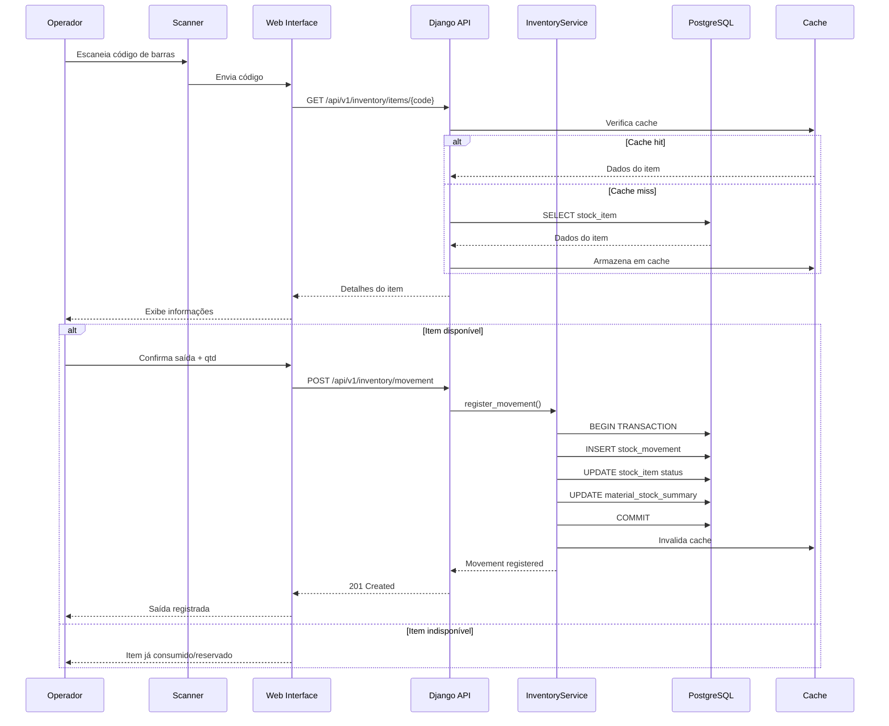

### 2.3 Fluxo de Impressão de Etiqueta

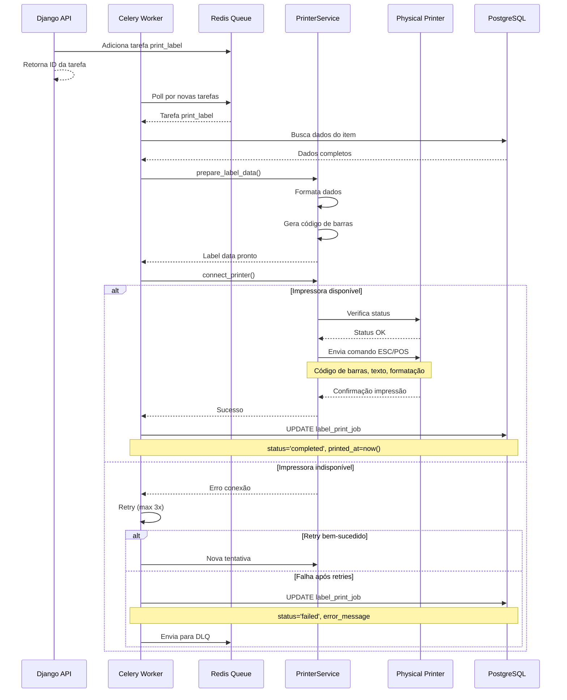

## 3. Diagrama de Classes

### 3.1 Camada de Modelos (Django Models)

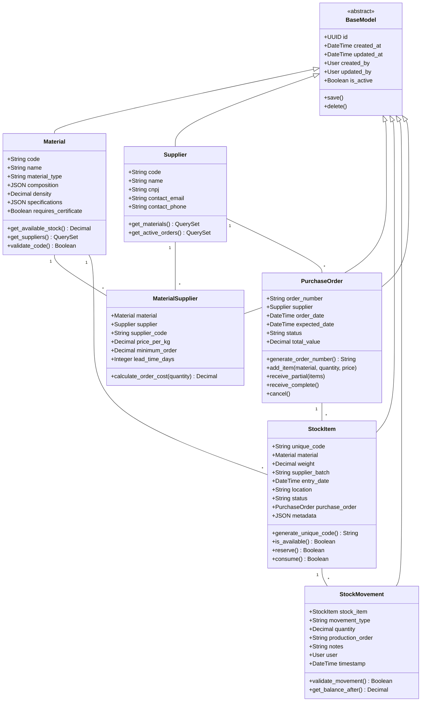

### 3.2 Camada de Serviços

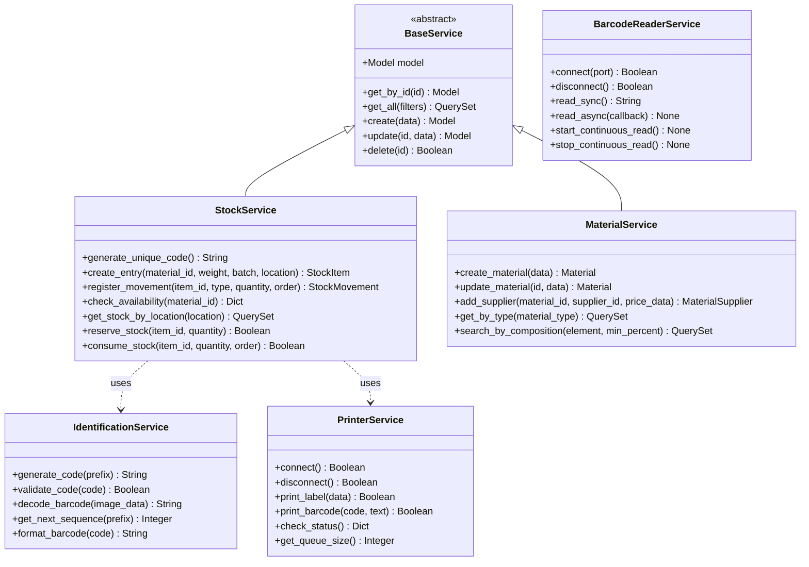

### 3.3 Camada de API (Django REST Framework)

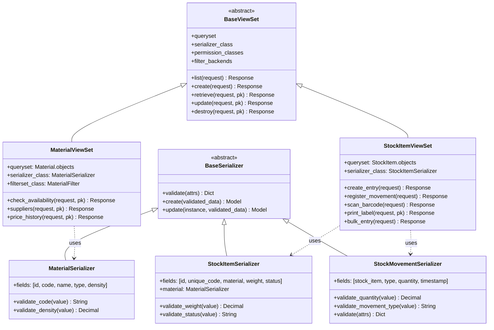

### 3.4 Camada de Tarefas Assíncronas (Celery)

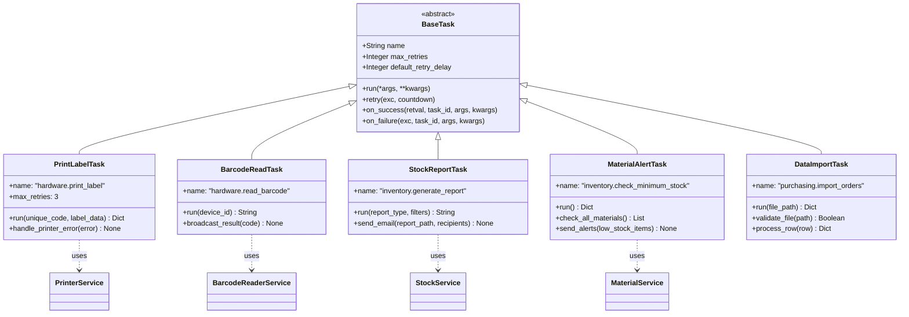

## 4. Diagrama de Componentes

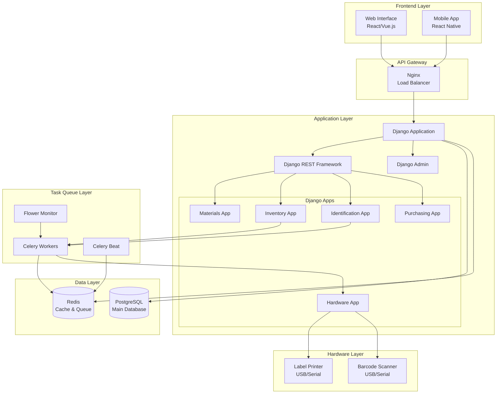

## 5. Diagrama de Estados - Ciclo de Vida do Item de Estoque

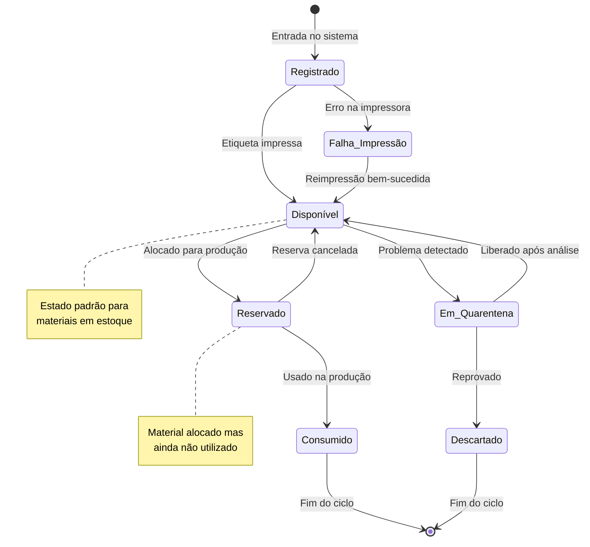

## 6. Diagrama de Atividades - Processo de Entrada de Material

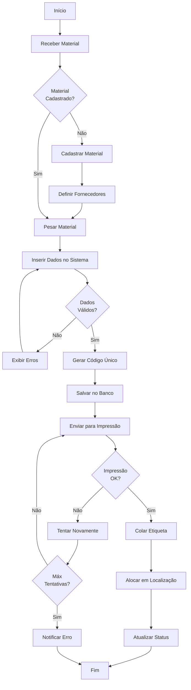

## 7. Notas de Implementação

### 7.1 Padrões de Código
- **Models**: Usar validators do Django para regras de negócio
- **Services**: Lógica de negócio isolada dos models
- **Serializers**: Validação de entrada/saída da API
- **Tasks**: Operações assíncronas e que podem falhar

### 7.2 Segurança
- Todas as operações autenticadas via JWT
- Auditoria em todas as tabelas (created_by, updated_by)
- Soft delete para manter histórico
- Backup diário do PostgreSQL

### 7.3 Performance
- Cache Redis para consultas frequentes
- Índices em campos de busca
- Paginação em todas as listagens
- Celery para operações pesadas